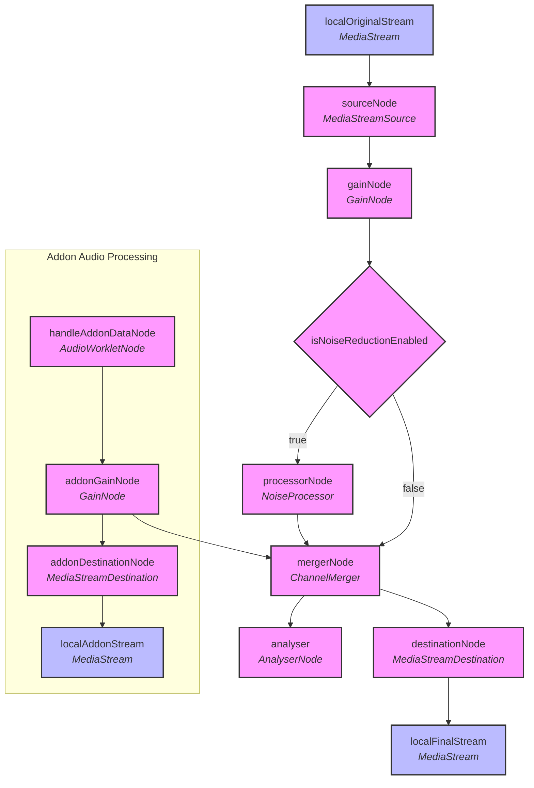

create from vite react ts template

electron backend use pure js and commonjs 

electron-builder needs node 20+

shadcn/ui installed in manually(could avoid electron dev launch slow problem, which always happens when using shadcn's vite install method)

tailwindcss init with postcss(init -p)

channelstore用于管理所有频道及其中的用户信息

currentuserstore用于管理当前用户自己的状态

dbstore用于管理从indexeddb中取出的用户自己的配置信息

mirror store仅用于从底层store中自动同步所需信息
sync service通过订阅mirror的变化来处理通过datachannel同步
使用datachannel中的sync_status同步所有客户端信息，每次均进行全量同步

**使用预设频道的用户与使用从频道服务中获取频道的用户之间的连接情形还未处理**

allowed js in `tsconfig.app.json`, js check is disabeled

audio nodes connection state:

rnn降噪模型会在dev启动时加载，占用约30s的vite准备时间
在打包完成后的启动中不会出现这个问题
未来会使用wasm版本的降噪模型替换现有的纯js版本模型